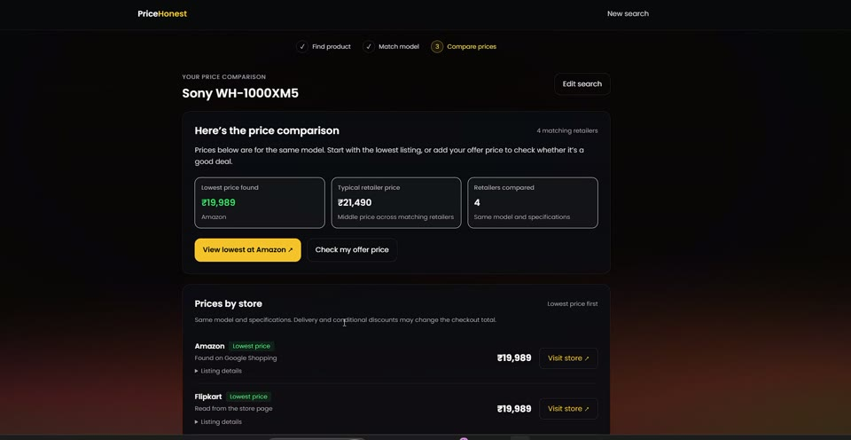
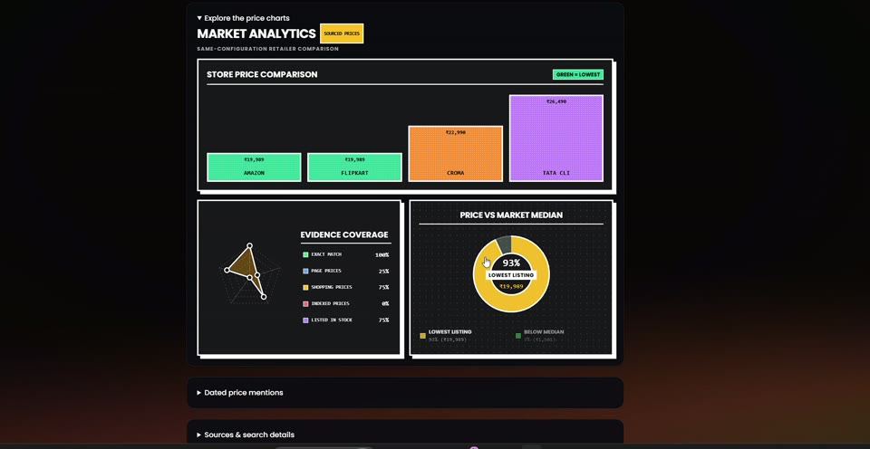

# PriceHonest

> **Not every red tag is a deal.**

PriceHonest is a product price comparison and deal investigation workspace for Indian shoppers. Give it a product name, a product-page URL, and optionally the price you are being offered. It searches trusted retailers independently, resolves Google Shopping offers to actual merchant product pages, verifies structured retailer prices where accessible, and compares matching configurations.

This is not a prettier discount badge. It is a way to interrogate the claim behind one.

---

## Preview

<p align="center">
  
</p>

| **Market Reality — Exposing Dark Patterns** | **Live Multi-Store Price Comparison** |
|:---:|:---:|
|  |  |
| *Identifies inflated MRPs, pre-sale spikes & hidden fees* | *Scans Amazon, Flipkart, Croma & Tata CLiQ in real time* |

<p align="center">
  
  <br />
  <em>Store Price Comparison, Evidence Coverage Radar, and Price vs. Market Median Analytics</em>
</p>

---

## Why it is useful

Retailers make the “original price” visually loud, while the market price stays hidden in other tabs. PriceHonest makes the comparison legible:

- **Market view:** the median and lowest relevant INR listings found right now.
- **Claim check:** advertised discount versus what the current market supports.
- **Receipts:** source links, listing titles, seller provenance, dated search context, and limitations.
- **Honest uncertainty:** comparable evidence without an offer price means `market_overview`; weak/no evidence means `insufficient_data`.
- **Action after the answer:** configuration selection, price refresh, a scenario calculator, JSON export, print, and share.

## What makes the SerpApi usage meaningful

SerpApi is the product’s evidence backbone, not a decorative search call:

1. **Google Shopping** supplies comparable seller listings and live prices.
2. **Separate, site-restricted, verbatim searches** check Amazon India, Flipkart, Croma, Reliance Digital, Vijay Sales, Tata CLiQ and JioMart, plus relevant official brand stores. Fashion/beauty searches also include relevant specialist stores.
3. **Google Search with a one-year window** supplies dated contextual mentions; these are never mislabeled as complete price history.
4. Deterministic filtering preserves the product model, excludes accessories/refurbished/wrong variants, deduplicates sellers, and calculates the verdict from the retained evidence.
5. The report exposes the sources and provider statuses so a judge can follow the whole chain from query → evidence → reasoning.

Live mode never silently substitutes fixtures. If SerpApi is unavailable, the report says so and refuses to invent a price comparison.

## Search accuracy and price comparison

- **Product identity first:** books, handbooks, user guides, bags, cases, compatibility accessories, wrong generations and wrong conditions are excluded from hardware searches.
- **Same configuration:** MacBook Air and Pro, M5 and M5 Pro/Max, screen sizes, RAM and storage are kept separate. Phone storage and product editions/generations are also separated. A broad search such as `MacBook M5` presents configuration choices before calculating a median.
- **Trusted domains:** a listing must link to an allowlisted Indian retailer's actual product page. A seller calling itself “Amazon” on an unrelated domain is excluded. Category pages, search pages, editorial posts, foreign storefronts and unavailable products cannot supply comparable prices.
- **Price provenance:** every offer says whether its price came from a retailer-page structured Offer, Google Shopping, or Google's retailer search index. Inaccessible retailer pages leave indexed prices explicitly labelled; these are not described as checkout-verified prices.
- **No first-number guessing:** MRP, monthly EMI, price ranges, foreign currency and conditional bank/exchange amounts are not silently substituted for selling prices. Broad impossibility checks and extreme same-configuration outlier checks prevent accessory-scale prices from defining a laptop comparison.
- **Inspectable results:** the report shows every retailer checked, matching offers with direct links, search failures, excluded listings, source timestamps and an explicit Refresh prices action.
- **Real progress:** the workspace consumes the streamed API events and supports cancellation. Its loading steps reflect actual provider work.
- **Honest analytics:** market savings are calculated against the comparable seller median. Charts show measured source coverage and actual price differences, with no invented honesty scores or fixed-percentage savings.

Use `MacBook M5` to choose a configuration, or search directly for `MacBook Air M5 13-inch 16GB 512GB`. Two confidently matched, same-configuration retailer quotes are required for a comparison verdict. One quote can still be shown without declaring a deal.

Retailer coverage describes sources checked, not guaranteed inventory. Indexed prices can lag checkout, and delivery/PIN-code availability must be confirmed on the retailer's page.

## Shopping flow and frontend performance

The Check Deal page has two clear entry points: **Compare prices** for a market comparison, and **Check my deal** for a supplied offer price. Broad searches present model choices first. Results put the lowest matching price and store links first; charts, delivery/coupon calculations and source details expand on demand. Edit search preserves the product details, model choices can be revisited, and a failed refresh keeps the previous comparison available.

The 3D visuals are retained with bounded rendering:

- Routes, backgrounds, charts and below-the-fold sections load separately.
- Ambient effects run at a maximum of 30 frames/second on desktop and 24 on mobile/constrained devices. The page's controls are not frame-rate limited.
- Background resolution is capped at one million pixels on desktop, with a smaller mobile budget and adaptive downscaling when rendering falls behind.
- Off-screen effects and hidden tabs pause their render loops. Shader cards do not initialize until needed.
- The 3D book guide pauses cover videos and ambient animations outside the viewport; the 3D CTA buttons stop drawing while inactive.
- Reduced-motion preferences retain a still rendering without recurring ambient animation.
- Typing, search progress and form edits do not recreate the background renderer. GPU resources and observers are cleaned up when their components leave the page.

For best runtime performance, use the production build (`npm run build`) rather than measuring Vite's development dependency optimization.

## Judge-ready demo script

### Reliable offline presentation (zero SerpApi credits)

The workspace uses Live mode. An explicit offline fixture is available through the API for `Sony WH-1000XM5`:

```bash
curl -X POST http://localhost:8080/api/check-deal \
  -H "Content-Type: application/json" \
  -d '{"productQuery":"Sony WH-1000XM5","claimedPrice":21499,"claimedOriginalPrice":34990,"mode":"demo"}'
```

Demo mode never manufactures generic ₹3,999 fixtures for arbitrary products; unsupported demo products return no prices. Fixture reports are labelled and do not record live observations.

### Live presentation

Open the workspace, use a specific model such as `Sony WH-1000XM5`, and optionally add the offer price. Try `MacBook M5` to show the configuration selector, then select one configuration and compare its retailer quotes. Inspect each price's source, the retailer coverage, and the direct product links.

## Run locally

### Requirements

- Node.js 20.19+ (Node 22+ recommended)
- npm
- A SerpApi key for Live mode (Demo mode works without one)

### Install and start

```bash
npm install
npm run dev
```

- Web app: `http://localhost:5173`
- API: `http://localhost:8080`

To run separately:

```bash
npm run dev:server
npm run dev:web
```

### Windows and WSL dependency setup

Install dependencies using the same operating system that runs the development server. For Windows development, run `npm install` and `npm run dev` in PowerShell or Command Prompt. Rollup and esbuild use OS-specific native packages; reinstalling the shared `node_modules` folder from WSL can replace the Windows packages with Linux packages.

If Windows reports `Cannot find module @rollup/rollup-win32-x64-msvc`, the matching package can be restored from PowerShell at the repository root:

```powershell
$rollupVersion = node -p "require(require.resolve('rollup/package.json', { paths: ['./apps/web'] })).version"
npm install --prefix apps/web --workspaces=false --include=optional --no-save --package-lock=false "@rollup/rollup-win32-x64-msvc@$rollupVersion"
npm run dev
```

### Verify

```bash
curl http://localhost:8080/api/health

# Explicit fixture check; this does not spend a SerpApi credit.
curl -X POST http://localhost:8080/api/check-deal \
  -H "Content-Type: application/json" \
  -d '{"productQuery":"Sony WH-1000XM5","claimedPrice":21499,"claimedOriginalPrice":34990,"mode":"demo"}'
```

### Build and test

```bash
npm run build
npm test
```

The server suite is intentionally offline. It covers the MacBook handbook regression, configuration separation/selection, missing and reversed specs, phones and AirPods generations, trusted product links, INR/EMI/MRP handling, retailer-page Offer parsing, independent retailer searches, partial provider failures, popup-to-merchant resolution, five-state verdicts, caching, explicit demo mode and NDJSON streaming.

## Environment

Copy `.env.example` to `.env` at the repository root:

```bash
SERPAPI_KEY=your_serpapi_key_here
PORT=8080
CORS_ORIGIN=http://localhost:5173
SERPAPI_TIMEOUT_MS=35000
```

`SERPAPI_KEY` is optional for Demo mode. Keep all keys server-side. Never place them in frontend code or commit `.env`.

A fresh live scan makes one Shopping search, one search per relevant retailer, one dated-context search, and up to three Shopping product-popup lookups. Evidence is cached for ten minutes; partial failures are cached only briefly. Refresh bypasses local/provider price caches.

## API surface

### `GET /api/health`

Returns safe provider status, server mode, and analysis version. It never returns secret values.

### `POST /api/resolve-product`

```json
{ "input": "https://www.amazon.in/Sony-WH-1000XM5/dp/B09XS7JWHH" }
```

Returns a safe product query, platform, and original URL. It rejects short/identifier-only URLs rather than pretending to know the product.

### `POST /api/check-deal`

```json
{
  "productQuery": "Sony WH-1000XM5",
  "claimedPrice": 21499,
  "claimedOriginalPrice": 34990,
  "mode": "live",
  "forceRefresh": false
}
```

Price claims are optional, positive INR numbers up to ₹1 crore. The server recomputes a verdict for each claim set even when the underlying source evidence is cached.

The response includes `comparison.status` (`ready`, `needs_selection`, or `insufficient`), configuration choices in `comparison.variants`, per-retailer `retailers` coverage, each offer's `priceSource`, and `evidenceObservedAt`. For `needs_selection`, no cross-configuration median or cheapest seller is returned. Submit a choice's `query` to compare that configuration.

### `POST /api/check-deal/stream`

Accepts the same request and returns newline-delimited JSON:

```json
{"type":"progress","step":"shopping","status":"running","message":"Checking shopping evidence…"}
{"type":"progress","step":"shopping","status":"done","message":"shopping evidence checked."}
{"type":"result","data":{"verdict":"market_overview"}}
```

The client can cancel an active scan. Disconnected clients abort upstream work where the provider supports it.

## Verdict model

The verdict is rule-based and inspectable:

- `genuine_deal`: a supplied offer is within a small tolerance of the lowest relevant listing or at/below the seller median.
- `inflated_discount`: the claimed original makes the discount materially larger than the current market supports, optionally reinforced by dated context.
- `not_actually_cheap`: the supplied offer is materially above the current seller median or is not among competitive listings.
- `market_overview`: no offer was supplied, so the report describes the market without calling it a deal.
- `insufficient_data`: fewer than two confidently matched, same-configuration listings, no usable evidence, or a configuration that must be selected; the system refuses to guess.

Confidence reflects the amount of comparable evidence, not a synthetic “honesty score.” The interface does not fabricate a radar chart, historical line, or savings figure.

## Architecture

```text
apps/web (React 18 + TypeScript + Vite 8)
  ├── landing narrative + live demo entry
  ├── investigation workspace
  ├── streamed progress and evidence report
  ├── scenario lab, saved targets, comparison, print/export/share
  └── responsive CSS design system

apps/server (Express + TypeScript)
  ├── /api/resolve-product
  ├── /api/check-deal and /stream
  ├── SerpApi Google Shopping + Google Search adapters
  ├── model/variant/accessory/condition/currency guardrails
  ├── evidence-only TTL cache + in-flight deduplication
  ├── optional first-party live observation snapshots
  └── deterministic verdict and rationale engine
```

The server exposes labelled fixtures only through explicit Demo requests. Live observation snapshots are stored in ignored `.data/` files when writable and separated by analysis version/configuration; no account or hosted database is required.

## Security and demo hygiene

- API keys are loaded only by the server.
- JSON request bodies are bounded and product queries are length-limited.
- Provider errors are sanitized and do not leak credentials or raw upstream payloads.
- CORS can be restricted with `CORS_ORIGIN`.
- Seller links are validated HTTP(S) URLs before rendering.
- Demo and Live source statuses are visible in the report.

## Judging narrative

**Idea strength:** make hidden market context visible before checkout.

**Originality:** treat a discount as a claim to investigate, with source provenance and explicit uncertainty, rather than as a badge to repeat.

**Technical complexity:** three purposeful SerpApi search paths, variant-aware evidence filtering, evidence caching, streamed progress, claim-sensitive deterministic analysis, and local price-target workflows.

**Usefulness:** a shopper receives a decision, the cheapest source, the comparison range, caveats, and a way to keep watching.

**Meaningful SerpApi usage:** without live Google Shopping and Search evidence there is no live market comparison or contextual explanation. The demo mode exists only to make judging reliable and is clearly labelled.
